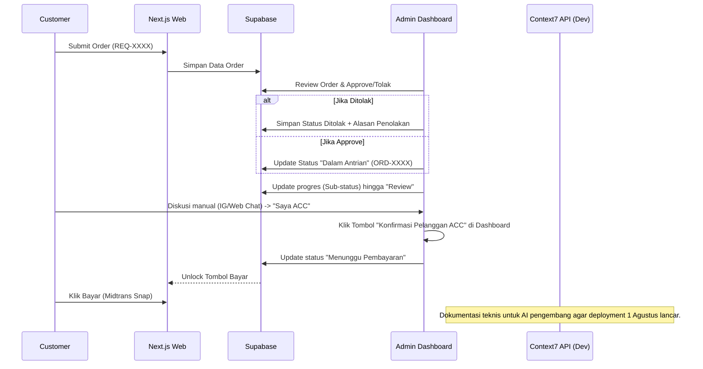
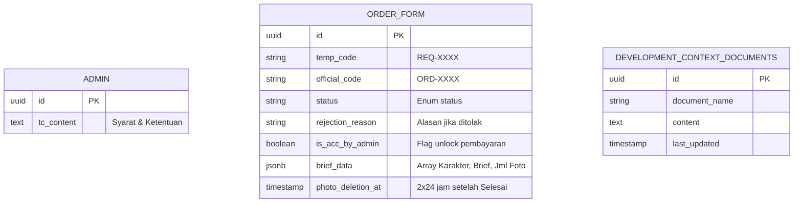

# PRD — Project Requirements Document

## 1. Overview
Aplikasi ini adalah sebuah platform SaaS (Software as a Service) untuk manajemen pemesanan (Order), kasir (Payment & Invoice), dan alur kerja bisnis kreatif/jasa. Aplikasi ini memecahkan masalah alur pesanan yang sebelumnya hanya ditangani secara manual melalui DM Instagram, di mana pembayaran tidak rapi, Syarat & Ketentuan (T&C) kurang jelas, perhitungan slot sering meleset, dan pengingat pelanggan masih dilakukan penuh manual. 

Tujuan utama sistem ini adalah menyediakan Landing Page yang profesional bagi pelanggan untuk melihat portofolio dan melakukan pemesanan sistematis, serta Dashboard Admin yang komprehensif untuk mengelola slot bulanan, status pesanan, pembayaran, dan komunikasi. Desain aplikasi akan mengusung tema simpel, minimalis, dengan dominasi warna putih dan aksen biru. **Target Deployment sistem adalah 1 Agustus.**

## 2. Requirements
- **Desain & UI/UX:** Tampilan web modern, bersih, dengan dominasi warna putih dan aksen biru. Desain tidak terlalu minimalis/simpel, namun tetap estetis dan profesional. Framework UI menggunakan komponen shadcn/ui. Desain responsif, nyaman diakses melalui browser HP maupun desktop.
- **Formulir Pemesanan Bertahap (High Priority):** Proses order pelanggan dibagi menjadi dua tahap yang didahului dengan persetujuan Syarat & Ketentuan (T&C). Pada Form Tahap 2, terdapat tombol '+' untuk menambah grup input (Karakter, Brief, Jumlah Foto) secara dinamis.
- **Manajemen File & Akses:** Kemampuan untuk pelanggan mengunggah foto referensi (upload) dengan batas maksimal 6 file. Admin memberikan akses file hasil kerja melalui tautan Google Drive (Review & Final). Cloudinary digunakan untuk pengelolaan unggahan gambar referensi dan portofolio. Kedua pihak wajib memastikan link GDrive dapat diakses ("Anyone with the link"). Foto referensi yang di-upload akan dihapus otomatis dari sistem (Cloudinary) setelah pesanan berstatus Selesai dengan countdown 2x24 jam.
- **Komunikasi:**
    - **Fase 1 (Manual):** Live Chat untuk pelanggan tanpa login. Notifikasi dan komunikasi dikelola secara manual oleh Admin untuk mengejar target rilis Agustus.
    - **Fase Berikutnya (Automated):** n8n digunakan untuk otomatisasi balas chat, Chat Reminder, dan AI Chatbot. UChat diintegrasikan untuk notifikasi otomatis ke Instagram saat status pesanan berubah menjadi "Review".
- **Pembayaran Digital (High Priority):** Integrasi Midtrans memungkinkan pelanggan membayar langsung dari halaman Cek Status melalui popup Snap (QRIS, e-wallet, virtual account, kartu). Tombol Bayar terkunci (disabled) jika status masih 'Review' dan admin belum klik konfirmasi "ACC".
- **Pembayaran Terkunci:** Jika Admin belum menekan tombol konfirmasi ACC di Dashboard (berdasarkan kesepakatan di luar sistem) saat proses Review sebelum batas 4x24 jam, maka Pembayaran Terkunci dan tombol Bayar tidak dapat diakses.
- **Ketersediaan & Kinerja:** Responsif digunakan pada perangkat seluler maupun desktop. Deployment di-containerize menggunakan Docker (mendukung Self-hosting/Home Lab), serta opsi deployment di Vercel/Supabase.
- **T&C & Ekspektasi:** Customer wajib mengisi brief dan/atau melampirkan foto referensi seakurat mungkin. CosGen.id tidak bertanggung jawab atas hasil yang tidak sesuai ekspektasi apabila brief/referensi yang diberikan kurang jelas. Estimasi waktu pengerjaan ±3 hari kerja efektif, dapat berubah tergantung tingkat kesulitan project dan antrian berjalan; CosGen.id tidak memberikan jaminan waktu pasti. Admin dapat mengubah teks T&C melalui Dashboard.
- **Reliabilitas Upload:** Upload foto referensi dan bukti bayar menampilkan status berhasil/gagal yang jelas.
- **WhatsApp (Out of Scope):** Fitur pengiriman pesan WhatsApp dan pengingat WhatsApp dikeluarkan dari cakupan pengembangan saat ini dan akan diurus secara terpisah.
- **Development Context Repository (Context7):** Seluruh dokumen teknis proyek (spesifikasi backend, logika database, instruksi deployment, dsb.) di-upload ke Context7 sebagai sumber konteks bagi AI pengembangan (seperti Gemini/Claude). Hal ini memastikan AI dapat memberikan bantuan coding yang akurat, sesuai realitas proyek, dan minim halusinasi terkait struktur sistem hingga deployment.

## 3. Core Features

**Fase 1 (Prioritas Utama - Target Rilis 1 Agustus)**
- **Landing Page Pelanggan & Portofolio:** Navigasi (Pricelist, Status, Pesan), Galeri masonry dinamis, slider Before-After, FAQ, dan manajemen konten.
- **Alur Pemesanan (Order Form):** Pengecekan sisa slot, persetujuan T&C, dan Form Multi-step bertahap dengan penambahan grup input dinamis.
  - **Sistem Penomoran Kode:** 
    - Kode Awal: `REQ-XXXX` (saat submit pertama kali/Menunggu Konfirmasi).
    - Kode Antrian: `ORD-XXXX` (saat pesanan sudah di-approve dan masuk antrian resmi).
- **Portal Cek Status Order (Customer):** Fitur cek progres transparan berdasarkan Kode Order (REQ/ORD). 
  - **Ringkasan Nota & Pembayaran:** Tampilkan rincian biaya. Tombol **"Bayar Sekarang"** (Midtrans Snap) aktif hanya setelah status "Menunggu Pembayaran".
  - **Pembayaran Terkunci:** Tombol Bayar disabled jika status masih "Review" dan Admin belum mengonfirmasi ACC.
- **Manajemen Pesanan & Pelanggan (Dashboard Admin):**
  - **Penolakan Pesanan:** Admin wajib mengisi **"Alasan Penolakan"** jika menolak pesanan.
  - **Konfirmasi ACC Manual:** Tombol di Dashboard untuk mengubah status ke "Menunggu Pembayaran".
  - **Edit T&C:** Menu khusus bagi admin untuk mengubah isi teks Syarat & Ketentuan.
  - **Manajemen Slot:** Kalender slot bulanan dan manajemen hari libur.
- **Sistem Autentikasi Admin:** Login aman via Supabase Auth dengan proteksi brute-force, Row Level Security, dan Middleware Next.js untuk mencegah akses ilegal.
- **Manajemen Item & Jasa (Price List):** Admin mengelola paket Pertalite, Pertamax, dan Pertamax Turbo (deskripsi, harga, revisi, dan syarat kamera).
- **Penghapusan Data Otomatis:** Foto referensi di Cloudinary dihapus 2x24 jam setelah status Selesai. Data komisi dihapus 3 hari setelah pergantian bulan.

**Fase 2 (Post-Launch - Tunda)**
- **Modul AI Chatbot & Automations:** Fitur ini dipindahkan ke pengembangan fase berikutnya setelah rilis Agustus.
  - **Teknologi Chatbot:** Akan dikembangkan menggunakan **Composio** dan **DataStax Astra DB** untuk embedding pengetahuan bisnis agar bot dapat menjawab pertanyaan pelanggan secara akurat di Instagram/UChat.
  - **Notifikasi Otomatis:** Integrasi n8n untuk status update ke Instagram dan reminder otomatis.

## 4. User Flow
**Alur Pelanggan (Customer Landing Page):**
1. Pengunjung masuk ke Landing Page, membaca T&C, dan klik "Pesan".
2. Mengisi Form Tahap 1 & 2. Penambahan grup input (Karakter, Brief, Jml Foto) via tombol '+'. Upload foto/referensi (maks 6).
3. Submit Pesanan. Sistem memberikan Kode Order sementara: **REQ-XXXX** dengan status **Menunggu Konfirmasi**.
4. Pelanggan cek status secara berkala.
   - Jika **Ditolak**: Pelanggan melihat status "Ditolak" beserta **Alasan Penolakan**. Order berakhir.
   - Jika **Disetujui**: Kode berubah menjadi **ORD-XXXX**, status menjadi **Dalam Antrian**.
5. Pelanggan memantau progres transparan (Sub-status: Making Concept hingga Blending + Grading).
6. Status berubah menjadi **Review**. Admin mengirimkan link GDrive Review.
7. Pelanggan berdiskusi dengan admin melalui chat (Manual via Web Chat/IG).
   - Jika **Revisi**: Admin mengubah status kembali ke "Sedang Dikerjakan".
   - Jika **Setuju (ACC)**: Pelanggan menyatakan setuju kepada admin.
8. Admin menekan tombol **"Konfirmasi Pelanggan ACC"** di Dashboard Admin.
9. Status berubah menjadi **Menunggu Pembayaran**. Tombol **"Bayar Sekarang"** (Midtrans Snap) aktif di portal cek status.
10. Pelanggan membayar via Midtrans. Setelah sukses, status menjadi **Selesai**. Pelanggan unduh file Final.

**Alur Admin (Dashboard):**
1. Admin login aman melalui Supabase Auth.
2. Meninjau `REQ-XXXX`. Klik **Approve** (Ubah ke ORD-XXXX) atau **Tolak** (Wajib isi alasan).
3. Update progres via sub-status pengerjaan secara berkala.
4. Klik tombol konfirmasi ACC setelah mendapat persetujuan pelanggan di luar sistem untuk membuka kunci pembayaran.
5. Midtrans memverifikasi pembayaran. Admin memberikan link GDrive Final dan mengubah status ke **Selesai**.

## 5. Architecture
Frontend Next.js (Admin & Customer), Backend Supabase (Auth, DB, Realtime Chat), Cloudinary (Storage), Midtrans (Payment), n8n (Integrasi GDrive), Context7 (Development Context Repository).

## 6. Database Schema

## 7. Tech Stack
- **Frontend:** Next.js (App Router), Tailwind CSS, shadcn/ui.
- **Backend:** Supabase (PostgreSQL, Auth, RLS).
- **Authentication:** Supabase Auth dengan Middleware proteksi dashboard dan pencegahan SQL Injection.
- **Images:** Cloudinary (Auto-deletion after 2x24h).
- **Payment:** Midtrans (Snap Integration).
- **Development Aid:** **Context7 API** sebagai repository dokumen teknis (DB, Backend, Deployment) demi akurasi asisten AI (Gemini/Claude) selama pengerjaan.
- **Deployment:** Docker (Self-hosting support), Vercel/Supabase. Target: **1 Agustus**.
- **Post-Launch Stack (Fase 2):** Composio & DataStax Astra DB (Chatbot knowledge embedding), n8n, UChat.

## 8. Non-Functional Requirements
- **Keamanan:** Perlindungan terhadap SQL Injection melalui parameterized queries Supabase, XSS protection, dan Row Level Security (RLS) pada database.
- **Skalabilitas Deployment:** Mendukung deployment Home Lab (Docker) dan Cloud secara fleksibel.
- **Reliabilitas:** Penanganan sinkronisasi folder Google Drive via API agar link selalu tersedia ("Anyone with the link").
- **Ketepatan Waktu:** Prioritas fitur inti dipastikan selesai untuk rilis 1 Agustus dengan menunda fitur AI Chatbot.